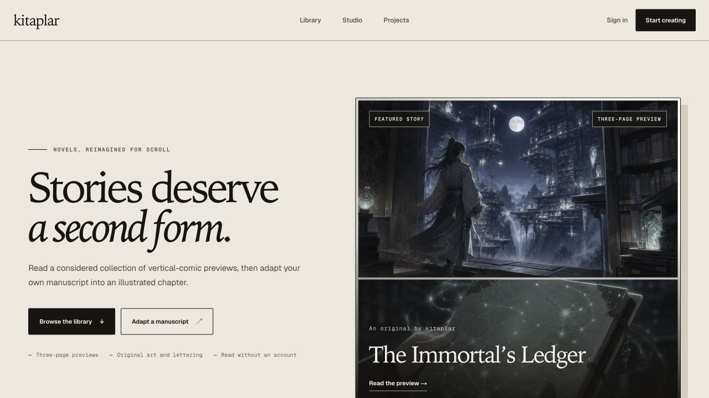

# kitaplar

kitaplar is a home for stories in a second form. Read short, scrollable
vertical-comic previews, or turn a manuscript you own into an illustrated
chapter with planned panels, dialogue, and lettering.

[Open kitaplar →](https://kitaplar-studio.akniventa.chatgpt.site)

