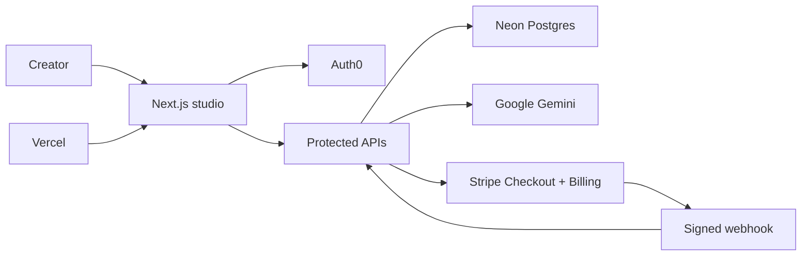

# PanelForge

PanelForge turns a light-novel chapter into an original, vertical-scroll manhwa
storyboard. It extracts story beats, plans cinematic panels, writes concise
dialogue and narration, reserves readable balloon space, and returns a
scroll-ready preview.

The repository is a production-oriented Next.js application with Auth0 login,
Stripe subscriptions, Neon Postgres persistence, Gemini generation, and Vercel
hosting. Service credentials and deployment configuration are managed through
[Stripe Projects](https://projects.dev/).

## What is included

- Electric creative-studio UI with paste and text-manuscript upload flows
- Original three-panel manhwa preview with accessible HTML/CSS dialogue bubbles
- Auth0 v4 server-side sessions and protected write APIs
- Structured 3–6 panel storyboard generation with a deterministic fallback
- Optional per-panel image generation behind an explicit feature flag
- Neon-backed users, projects, generation jobs, panels, subscriptions, and
  idempotent webhook receipts
- Stripe Checkout subscription, Customer Portal, and signed webhooks
- Boolean-only health endpoint that never returns credentials
- Vercel-ready production build and Drizzle migrations

## Architecture



Stripe Projects is the source of truth for provisioned service credentials and
project variables. Generated credentials are written to ignored local files and
must never be committed.

## Local development

Requirements:

- Node.js 22.13 or newer
- Stripe CLI with the Stripe Projects plugin
- Access to the Stripe Projects project represented by `.projects/state.json`

```bash
npm install
DEV_MODE=true stripe projects auth
DEV_MODE=true stripe projects env --pull
set -a; source .env; set +a; npm run db:push -- --force
npm run dev
```

Open [http://localhost:3000](http://localhost:3000). Auth0 retains localhost
callback, logout, and web-origin entries alongside the production URL.

For a standalone configuration, copy `.env.example` to an ignored environment
file and fill in each value. Do not commit API keys, webhook secrets, database
URLs, or Auth0 client secrets.

## Generation behavior

`POST /api/generate` accepts:

```json
{
  "title": "The Moonlit Archive",
  "chapterTitle": "Chapter 1 · The First Bell",
  "manuscript": "Chapter prose…",
  "stylePreset": "Cinematic webtoon"
}
```

It also requires an `Idempotency-Key` header. The API permits one active
generation per account, atomically reserves a chapter credit, and refunds that
credit if generation fails before completion.

The text model is required to return a strict storyboard schema. The prompt uses
high-level vertical-comic craft principles—clear top-to-bottom reading order,
asymmetric setup/detail/breath/reveal pacing, consistent character continuity,
intentional negative space, and balloons that do not cover faces or focal
action. It forbids imitating artists and unrelated series.

Creators may attach one optional JPEG, PNG, or WebP continuity panel. The
browser compresses it before upload, the server validates and normalizes it,
and Gemini uses it to carry forward recurring character, costume, palette, and
rendering cues. New panels must use different poses, compositions, backgrounds,
and lettering from the reference.

If the text provider is unavailable, PanelForge returns a deterministic
four-beat storyboard. Live image generation is disabled by default:

```bash
ENABLE_LIVE_IMAGE_GENERATION=false
```

Enabling it can incur model-provider usage costs. All storyboard panels are
requested concurrently, preserve their reading order, and are capped at 450 KiB
each so the aggregate JSON remains within Vercel’s function response budget.
Generated image data is response-scoped; provision object storage before
retaining full generated chapters.

Gemini uses the official `@google/genai` server SDK. `GEMINI_API_KEY` is read
only by protected server routes and must never use a `NEXT_PUBLIC_` prefix. The
defaults are `gemini-3.6-flash` for structured storyboards and
`gemini-3.1-flash-image` for 2:3 panel artwork; override them with
`GEMINI_TEXT_MODEL` and `GEMINI_IMAGE_MODEL`.

Gemini renders text-free artwork with intentional negative space. The server
then composites exact dialogue, narration, thoughts, and sound effects into
each successful panel JPEG with Sharp. This keeps spelling deterministic,
avoids duplicate browser overlays, and preserves the 450 KiB per-panel response
budget.

## Billing

The included Stripe test-mode product is a monthly Starter subscription with
six chapter credits. Checkout creates or reuses one Stripe customer bound to the
Auth0 subject, blocks duplicate subscriptions, and uses server-generated
idempotency. The Customer Portal uses that stored customer binding rather than
email lookup.

The signed webhook persists subscription state to Neon, ignores stale and
duplicate events, resets six credits on a new billing period, and revokes
credits when the subscription is no longer active or trialing. Generation
reserves credits with a conditional database update, so concurrent requests
cannot overspend the balance.

Use Stripe test cards only in the current environment. Replace the test price,
restricted key, and webhook endpoint deliberately before accepting live
payments.

## Commands

```bash
npm run dev          # Start Next.js locally
npm run lint         # Run ESLint
npm run build        # Create a production build
npm run test         # Lint and build
npm run db:generate  # Generate a Drizzle migration
npm run db:push      # Apply schema changes to Neon
```

## API routes

- `GET /api/health` — terse, credential-safe readiness status
- `GET /api/projects` — list the signed-in user’s generation history
- `POST /api/generate` — generate and persist a storyboard
- `POST /api/checkout` — create a Stripe subscription Checkout Session
- `POST /api/billing-portal` — open the Stripe Customer Portal
- `POST /api/webhooks/stripe` — verify and receive Stripe events

## Visual reference policy

PanelForge studies current WEBTOON presentation conventions at the craft level:
vertical pacing, focal hierarchy, expressive close-ups, clean gutters, and
readable bubble placement. It does not copy source artwork, characters,
dialogue, layouts, or a specific artist’s style.
